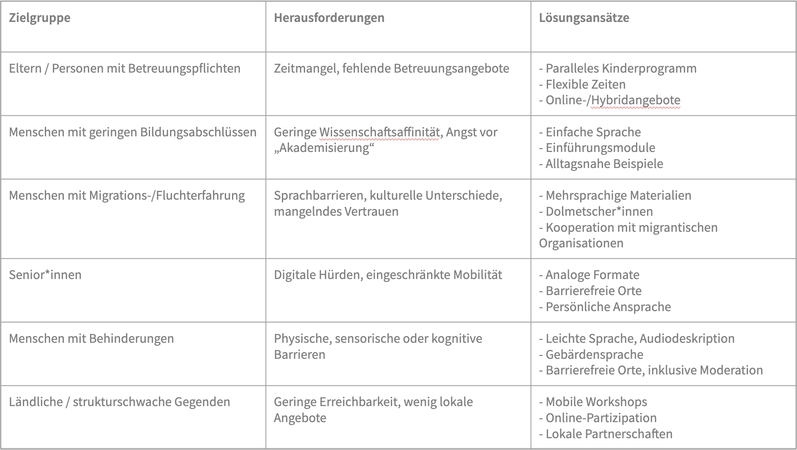

# Arbeitsgruppe Workshop
## Abschlusspräsentation

---

## Inhalt

- ### Hintergrund
- ### Inhalt des Leitfadens
    - Curriculum
    - Vortragsfolien
    - Zeitplan für die Organisation
    - Regieplan für die Veranstaltung
- ### Diversität: Herausforderungen und Lösungsansätze
- ### Methodensammlung
- ### Verantwortlichkeit des Workshops

---

## Hintergrund & Ziel des Workshops

- **Ziel:** Niedrigschwellige Wissensvermittlung & Partizipation
- **Orientierung an:** Bürger Café, Netzwerk für Demokratie und Courage
- **Zielgruppe:** u. a. Bibliotheken und Kultureinrichtungen

---

## Der Leitfaden – eine komplette Anleitung für einen Workshop
### Enthaltene Materialien:

- **Curriculum (10 Seiten)**  
  Hintergrund, Workshopaufbau & Durchführungstipps

- **Präsentationsfolien (36 Slides)**  
  Inhalte anschaulich & teilnehmergerecht aufbereitet

- **Zeitplan**  
  Schritt-für-Schritt-Ablauf inkl. Checklisten

- **Regieplan**  
  Planung im Vorfeld: Werbung, Organisation, Logistik

---

## Das Curriculum im Überblick

- **Curriculum als zentraler Bestandteil**
- Ziel: Hilfe für Workshopleitung bei Einsteiger\*innenformat
- Enthält:

  - Vorbereitung (Ziele, Ablauf, Organisation)
  - Durchführung (Einführung, OWI-Hintergrund, Kuratierung)
  - Mitmachphase (Tools & Übungen)

---

## Die Präsentationsfolien für den Workshop

- **36 Folien** begleitend zum Curriculum
- Vermitteln den kompletten **inhaltlichen Ablauf** des Workshops
- Enthalten:
  - Tipps für die Moderation  
  - **Speaker Notes** mit Hintergrundinfos und Zeitangaben  
  - Interaktive Elemente, Visualisierungen und Übungen

> **Ziel:** Die Folien ermöglichen eine konsistente, leicht durchführbare Workshop-Leitung – auch ohne Vorerfahrung.

---

## Organisation & Planung

### Zeitplan

- Enthält To-Dos und Fristen zur Workshop-Planung
- Basierend auf: EU Citizen Science Plattform
- Erfahrungswerte durch Bibliotheken einholen

---

## Regieplan

- Enthält den Ablauf des Workshops
- Teilweise enthalten: praktischer Teil (Mitmach-Oberfläche OWI noch in Arbeit)
- Vorlage: Evaluationsbericht Bürgercafés Stuttgart

---
## Diversität: Herausforderungen & Lösungen

### Beispiel: Eltern mit Betreuungspflichten

- Herausforderung: Zeitmangel, keine Betreuung
- Lösung:

  * Kinderprogramm
  * Flexible Zeiten
  * Online-/Hybrid-Angebote

*(weitere Zielgruppen folgen auf den nächsten Folien)*

---

---

## Methodensammlung (Auswahl)

- **P.L.A.Y.** – Gruppenermutigung
- **Rundgespräch** – Kriterien erarbeiten
- **Flipchart** / Online-Dokument – Präsentation
- **Verweis auf OWI-Unterlagen** – kindgerechte Formate

---

## Parallelprogramm für Kinder

- Ziel: Betreuung für Kinder (6–12 Jahre)
- Idee: Workshop über Suchmaschinen für Kinder
- Bezug: Materialien der Open Search Foundation
- Noch nicht im Arbeitspaket ausgearbeitet

---

## Verantwortlichkeit & Durchführung

- Workshopleitung: Personen mit OWI-Kompetenz
- Möglichkeit zur Qualifizierung (z. B. Mentorenmodell wie bei Wikipedia)
- **Dashboard**: Leitung buchbar

---

## Externe Kooperationen

- Externe können:

  * Fachwissen einbringen
  * Begleitveranstaltungen anbieten
  * Hürden für Zielgruppen abbauen

- Beispiele:

  * ichbinhier
  * Digitaler Engel
  * Deutschland sicher im Netz

---

## Noch offene Punkte

- Design für Leitfaden:

  * Barrierefrei
  * Im OWI-Stil
  * Klar und ansprechend

- Externe Partner gesucht (jenseits Fokus auf Senior\*innen)